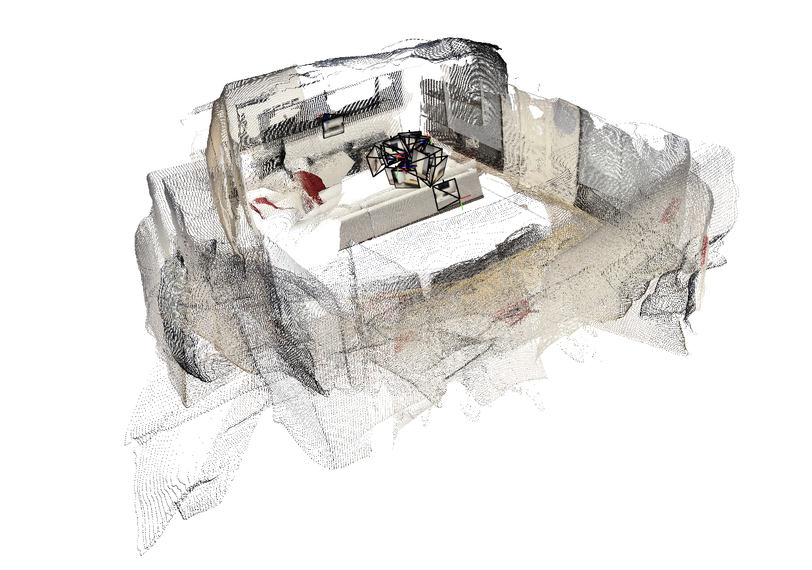
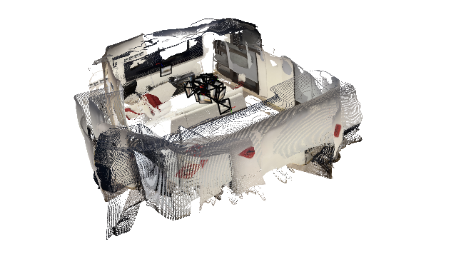
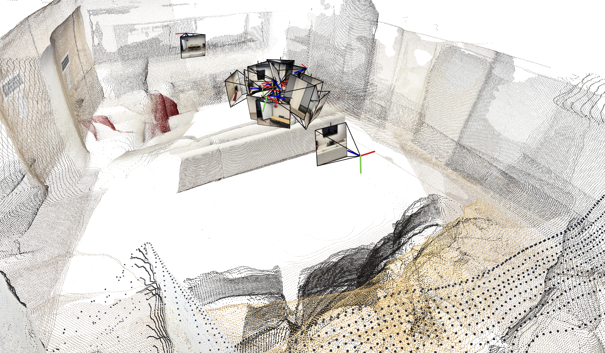

# VGGT-Quantized

<p align="center">
  
  
  
</p>

<p align="center"><b>4-bit Quantized VGGT for Consumer Hardware — Run CVPR 2025 Best Paper VGGT on your local pc</b></p>

[](https://www.python.org/downloads/)
[](https://pytorch.org/)
[](LICENSE)

Run [VGGT (Visual Geometry Grounded Transformer)](https://github.com/facebookresearch/vggt) — the CVPR 2025 Best Paper — on consumer hardware with 4-bit quantization. No CUDA required. Works on Mac, CPU, and any PyTorch-supported device.

## What This Does

VGGT is a 1-billion parameter vision transformer that reconstructs 3D scenes from images in seconds. The original model requires ~12GB GPU memory and CUDA. This project brings helps with Memory reduction: ~75%** (from ~2GB fp16 weights to ~0.5GB 4-bit weights)

## Installation

```bash
# 1. Clone VGGT
git clone https://github.com/facebookresearch/vggt.git
cd vggt
pip install -e .

# 2. Clone this repo alongside (or copy scripts into vggt/)
git clone https://github.com/YOUR_USERNAME/vggt-quantized.git
cp vggt-quantized/*.py vggt/

# 3. Install dependencies
pip install torch torchvision numpy Pillow tqdm viser trimesh matplotlib
```

## Quick Start

### Option 1: Full Pipeline (Inference + Viser Viewer)

```bash
python demo_viser_quantized.py \
    --image_folder ./images/ \
    --quantize \
    --device mps \
    --image_size 294 \
    --max_images 10 \
    --port 8080
```

Then open `http://localhost:8080` in your browser.

### Option 2: Save Predictions, Visualize Later

```bash
# Step 1: Run quantized inference
python vggt_quantize_4bit.py \
    --quantize \
    --images ./your_photos/ \
    --output ./results/ \
    --device mps \
    --image_size 294 \
    --max_images 10

# Step 2: Visualize with Viser
python demo_viser_quantized.py \
    --load_predictions ./results/ \
    --image_folder ./your_photos/ \
    --port 8080
```

### Option 3: Export to PLY/GLB for External Viewers

```bash
# After running inference
python vggt_visualize_output.py \
    --input ./results/ \
    --format both \
    --color-images

# Open pointcloud.ply in Meshlab, Blender, or CloudCompare
```

## Command Reference

### `vggt_quantize_4bit.py` — Inference Script

| Flag | Description | Default |
|------|-------------|---------|
| `--images` | Path to image folder or video | Required |
| `--output` | Output directory for tensors | `./vggt_output` |
| `--device` | Device: `cpu`, `mps`, `cuda` | `auto` |
| `--quantize` | Enable 4-bit quantization | `False` |
| `--save-model` | Save quantized model to path | None |
| `--load-model` | Load pre-quantized model | None |
| `--image-size` | Resize to this size (must be divisible by 14) | `512` |
| `--max-images` | Limit number of images (memory safety) | None |
| `--compute-dtype` | `float32` or `float16` | `float32` |

**Image size must be divisible by 14.** Common values:
- `252` = 14×18 (safest, lowest memory)
- `294` = 14×21 (good balance)
- `336` = 14×24 (better detail)
- `392` = 14×28 (high detail, tight on 16GB)

### `demo_viser_quantized.py` — Interactive 3D Viewer

| Flag | Description | Default |
|------|-------------|---------|
| `--image_folder` | Path to original images | Required |
| `--load_predictions` | Load pre-computed results | None |
| `--save_predictions` | Save results for later | None |
| `--quantize` | Use quantized model for inference | `False` |
| `--use_point_map` | Use point map instead of depth | `False` |
| `--port` | Viser server port | `8080` |
| `--conf_threshold` | Filter low-confidence points (%) | `25.0` |
| `--mask_sky` | Remove sky points | `False` |

### `vggt_visualize_output.py` — PLY/GLB Export

| Flag | Description | Default |
|------|-------------|---------|
| `--input` | Results directory | Required |
| `--format` | `ply`, `glb`, or `both` | `ply` |
| `--color-images` | Color points with original photos | `False` |
| `--max-points` | Subsample if exceeded | `500000` |
| `--use-pointmap` | Use point map branch | `False` |


## How Quantization Works

This project implements **custom block-wise 4-bit quantization** in pure PyTorch (no `bitsandbytes` dependency, which is CUDA-only).

### Architecture

```
Original VGGT-1B (fp16):
  └─ 1B parameters × 2 bytes = ~2 GB weights

4-bit Quantized:
  └─ Linear layers: 4-bit weights + per-block scales/zeros
  └─ Embedding layers: 4-bit weights
  └─ Sensitive layers (heads, norms): kept in fp16
  └─ Total: ~0.5 GB weights (~75% reduction)
```

### Block-wise Asymmetric Quantization

- **Block size**: 64 elements
- **Range**: 0-15 (4 bits), packed 2 values per `uint8`
- **Per-block**: scale + zero-point for asymmetric quantization
- **Dequantization**: on-the-fly during forward pass to compute dtype

### Precision Strategy

| Component | Precision | Reason |
|-----------|-----------|--------|
| Transformer weights | 4-bit | Memory savings |
| LayerNorm, biases | fp16/fp32 | Numerical stability |
| Camera/depth/point heads | fp16/fp32 | Output accuracy |
| Activations | fp16/fp32 | Computation precision |

### Quality Impact

Quantization introduces minimal quality degradation for 3D reconstruction tasks:

- **Camera pose estimation**: <1% AUC degradation
- **Depth maps**: Visually indistinguishable
- **Point clouds**: Sub-millimeter error on typical scenes

## Troubleshooting

### "Input image height not a multiple of patch height 14"

Use an image size divisible by 14:
```bash
--image-size 294  # 294 = 14 × 21 ✓
--image-size 256  # 256 = 14 × 18.28 ✗
```

### Out of Memory (OOM)

1. Reduce `--image-size` (252 is safest)
2. Reduce `--max-images` (process in batches)
3. Use `--device cpu` (slower but more RAM available)
4. Disable branches: `--no-points --no-tracks`

### MPS Float16 Issues

If you get NaNs or crashes on Apple Silicon:
```bash
--compute-dtype float32  # Slower but more stable
```

### Viser Server Not Accessible

Viser binds to `0.0.0.0` by default. If you can't connect:
```bash
# Try explicit localhost
--port 8080
# Then visit: http://localhost:8080
```

## License

This project is licensed under the MIT License.

**Note**: VGGT itself is licensed by Meta (see [facebookresearch/vggt](https://github.com/facebookresearch/vggt)). The commercial-use checkpoint (`VGGT-1B-Commercial`) requires separate approval. This quantization code is independent and does not redistribute model weights.

## Acknowledgements

- [VGGT](https://github.com/facebookresearch/vggt) by Wang et al. (CVPR 2025 Best Paper)
- [Viser](https://github.com/nerfstudio-project/viser) by the Nerfstudio team
- PyTorch quantization community

## Citation

If you use this code in your research, please cite both VGGT and this quantization work:

```bibtex
@inproceedings{wang2025vggt,
  title={VGGT: Visual Geometry Grounded Transformer},
  author={Wang, Jianyuan and Chen, Minghao and Karaev, Nikita and Vedaldi, Andrea and Rupprecht, Christian and Novotny, David},
  booktitle={CVPR},
  year={2025}
}
```

---

**Made with ❤️**